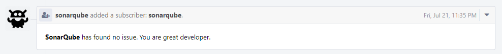
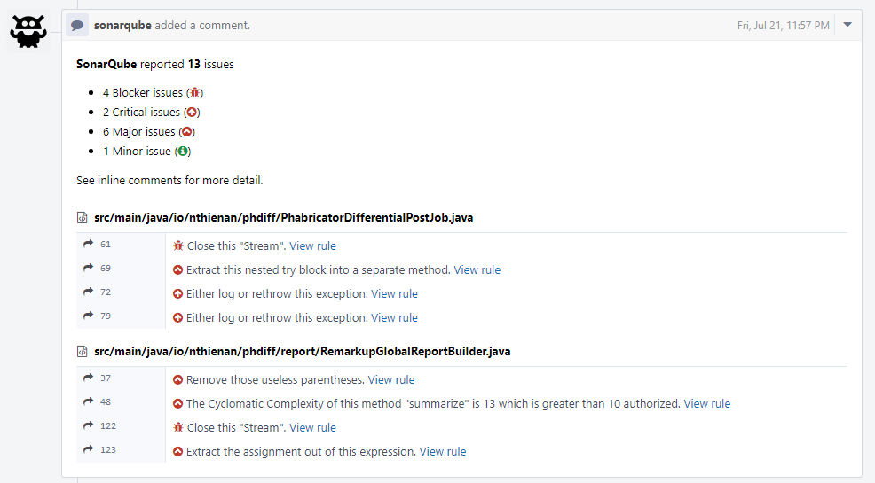
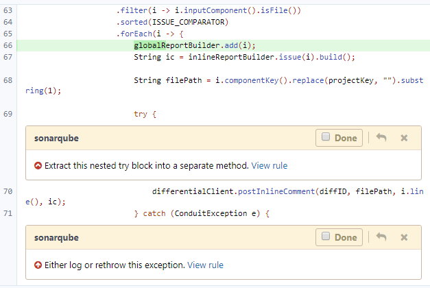
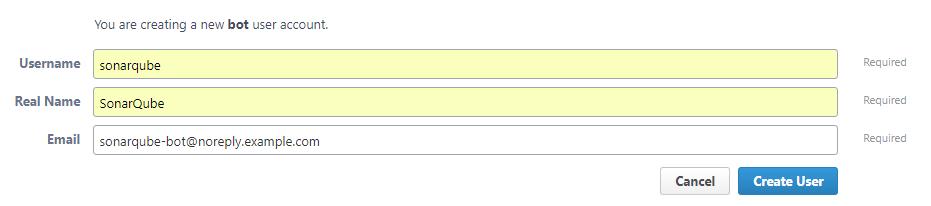
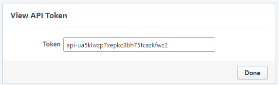
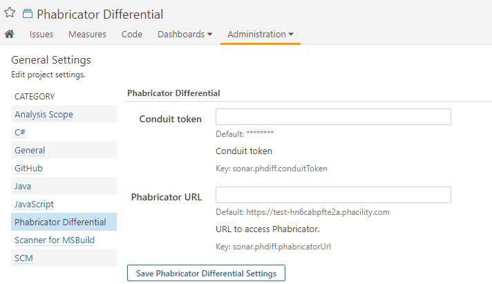
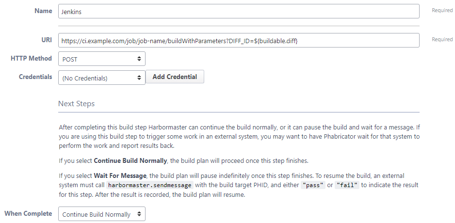
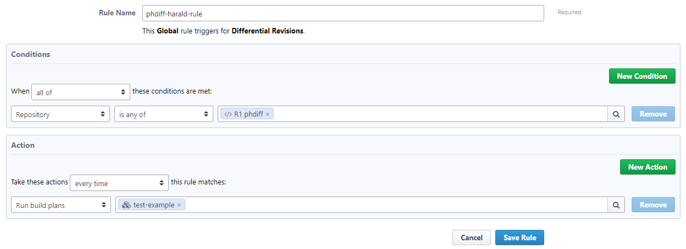

# Phabricator Differential Sonar Plugin 

The Phabricator Differential plugin provides integration with Phabricator. It allows SonarQube to analytic and report issues on differential revision without pushing results to SonarQube. Any issues that are found are published as comments on the revision.
The plugin performs the following operations:
1. Add a global comment that gives a summary of the analysis

2. Add an inline comment for each issue

### Installation
**phdiff** is not published to Update Center yet, so follow these steps to install:
- Clone this repo
- Run: `mvn clean package`
- Copy `target/phdiff-<version>.jar` to `$SONAR_HOME/extensions/plugins`
- Restart SonarQube

### Configuration
- **Requirements**
  - SonarQube Server must be up and running. 
  - Minimal SonarQube Version: 5.6
  - The Phabricator Differential plugin is installed on SonarQube Server.
  - A Jenkins server is installed

- **Create SonarQube bot**
1. Navigate to `https://phabricator.example/people` with your base Phabricator URL in place of `phabricator.example`.
2. Click the **Create New User** button in the top right corner of the page
3. Choose **Create Bot User** for the **Account Type** option and click **Continue** button
4. Enter **Username** field by `sonarqube`, **Real Name** field by `SonarQube`, **Email Address** field by `sonarqube-bot@noreply.example.com`

 
5. Click **Create User** button
6. Go to **SonarQube** bot user profile and click **Manage** at the left of page, then click **Edit Settings** link at the right of page
7. Click **Conduit API Tokens**, then click **Generate API Token** button in the top right corner of the page, click **Generate Token**
8. Copy token and store somewhere to use for later steps

- **SonarQube**
1. Navigate to `https://sonarqube.example/settings?category=phabricator+differential` with your base Phabricator URL in place of `sonarqube.example`
2. Enter `token` that was generated from create sonarqube bot steps above into **Conduit token** filed
3. Enter Phabricator URL into **Phabricator URL** field
4. Click **Save Phabricator Differential Settings** button
5. Navigate to the **Post-build Actions** section.
6. Click the **Add post-build action** button and select **Post to Phabricator**.

**Note:** These setting can override for each project at Project Administration Settings page.

- **Jenkins job**
1. Navigate to the Jenkins job you want to integrate with Phabricator.
2. Click the **Configure** button.
3. Click the **Add Parameter** button and select **String Parameter**.
4. Enter `DIFF_ID` in the **Name** field of the parameter.
5. Navigate to the **Build** section.
6. Click the **Add build step** button and select Maven or Gradle.
7. Enter these options: `-Dsonar.analysis.mode=preview -Dsonar.phdiff.diffId=${DIFF_ID}`

**Note:** You can combined this jenkins job with [Phabricator Jenkins plugin](https://github.com/uber/phabricator-jenkins-plugin) job to do two things in one job

- **Harbormaster**
  - With Phabricator, Jenkins, and your Jenkins jobs configured it's time to configure a new Harbormaster build plan. This build plan will trigger the Jenkins job using a Herald rule that will be configured in the next section.
1. Navigate to `https://phabricator.example/harbormaster/plan/` with your base Phabricator URL in place of `phabricator.example`.
2. Click the **Create Build Plan** button in the top right corner of the page.
3. Enter a name for the build plan in the **Name** field. For these instructions, we'll use "test-example" as the build name.
4. Click the **Create Build Plan** button.
5. Click the **Add Build Step** button.
6. Click the **Make HTTP Request** step.
7. Use this template URI to fill in the URI field for the build plan: `https://ci.example.com/job/job-name/buildWithParameters?DIFF_ID=${buildable.diff}`. 
Be sure to replace `https://ci.example.com` with the URI of your Jenkins instance and `test-example` with the name of your Jenkins job. 
If your Jenkins instance is exposed to the internet, make sure to install the [Build Token Root Plugin](https://wiki.jenkins-ci.org/display/JENKINS/Build+Token+Root+Plugin) and fill in the `token` parameter.
8. Click the **When Complete** dropdown menu and select **Continue Build Normally**.
9. Click the **Create Build Step** button.

- **Herald**
  - With the build plans created it's time to create a Herald Rule to trigger the plans. The steps below will configure a Herald Rule to trigger the build plans on Differential Revisions to your repository.

1. Navigate to `https://phabricator.example/herald/` with your base Phabricator URL in place of `phabricator.example`.
2. Click the **Create Herald Rule** button in the top right corner of the page.
3. Select the **Differential Revisions** checkbox and click **Continue**.
4. Select the **Global** checkbox and click **Continue**.
5. Enter a name for the Herald Rule in the **Rule Name** field.
6. In the **Conditions** section, click the dropdown menu that says "Author" and select "Repository".
7. Enter your repository name in to the blank field in the **Conditions** section.
8. In the **Actions** section, click the dropdown menu that says "Add blocking reviewers" and select "Run build plans".
9. Enter the build plans that were created in the previous section in to the blank field in the **Action** section.

10. Click **Save Rule**.

### Manually analytic revision
- Gradle: `gradle sonarqube -Dsonar.analysis.mode=preview -Dsonar.phdiff.diffId=<your-diff-id>`
- Maven: `mvn sonar:sonar -Dsonar.analysis.mode=preview -Dsonar.phdiff.diffId=<your-diff-id>`

### Contribute
Please open all pull requests and issues against [https://github.com/thienan93/phdiff](https://github.com/thienan93/phdiff)

Fixing SonarQube issues of this plugin at [sonarcloud.io](https://sonarcloud.io/dashboard?id=io.nthienan%3Aphdiff)

### License
[Apache License, Version 2.0](LICENSE)
